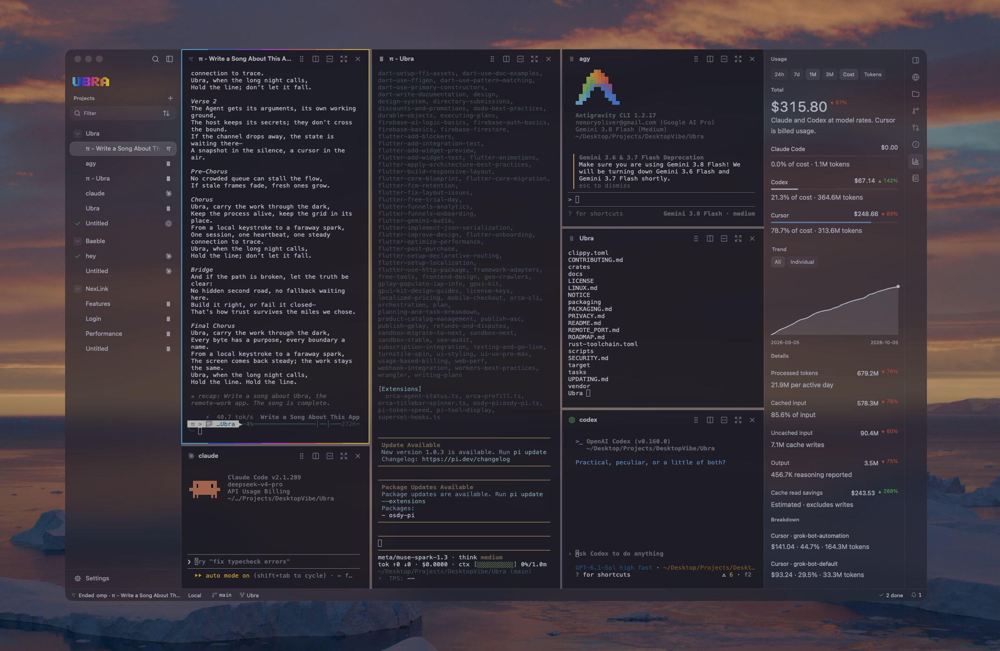

# Ubra

**A native desktop workspace for running and coordinating the coding-agent CLIs you already use.**

Keep parallel sessions visible, give independent tasks separate Git worktrees, and review changes in context. Ubra helps you spend less time switching between terminals while you stay in control of the work.

> **Ubra is not released yet.** Release installers are not published. [**Get notified about the release**](https://getubra.com/).

## What you can do

- Run multiple agent sessions in a project and arrange them in panes.
- See which sessions are working, need input, or have finished. Browse the app-wide Notifications inbox in the resizable right sidebar, using the same window material as its other tabs; its rail tab, the status-bar bell, or ⌘⇧I toggles it. Opening an update focuses its session without closing the inbox. Transient feedback and macOS system alerts stay unchanged.
- Keep parallel changes organized in separate Git worktrees and branches. Worktrees reduce edit collisions; they are not security sandboxes.
- Inspect diffs, stage and commit changes, and follow pull request checks beside the sessions that produced them.
- Use Ubra's built-in MCP server to let supported agents delegate work and coordinate with other sessions.
- Keep sessions running when the desktop app closes or the Engine restarts.
- Keep notes alongside agent work.
- Run sessions locally or connect to supported SSH hosts.

Resume and fork behavior depends on the agent CLI.

## Availability

The desktop app targets macOS 15 or newer on Apple silicon and Intel. No desktop release is available yet. [Get notified when Ubra is ready](https://getubra.com/), or [browse the source](https://github.com/Ubra-Dev/ubra).

## Agents and integrations

Ubra supports a growing catalog of agent CLIs. Integration depth differs by agent; Claude Code and Codex have the deepest status and resume integrations. See [Agent manifests](docs/AGENT-MANIFESTS.md) for the catalog and custom manifest details.

## Local, remote, and privacy

Sessions run locally or over SSH. Remote Helper targets are Linux x86_64/aarch64 and macOS arm64; Intel macOS and Rosetta are not supported Helper targets. This does not imply Linux desktop support. SSH is the transport. Remote sessions do not require tmux, sudo, an Ubra account, or a hosted session relay. See [REMOTE_PORT.md](REMOTE_PORT.md) for details.

Agents, shells, and MCP servers run with your user permissions. Ubra is not a sandbox, and worktrees do not restrict what an agent can access. See the [security model](docs/SECURITY-MODEL.md).

Ubra collects diagnostics unless sharing is disabled. Diagnostics exclude terminal input and output, prompts, and file contents. See [PRIVACY.md](PRIVACY.md) for the collected fields, controls, local storage, and network activity.

## Contribute

See the [contributor guide](CONTRIBUTING.md) for setup and review expectations. Report bugs or propose changes in [Issues](https://github.com/Ubra-Dev/ubra-app/issues); follow project direction in the [Roadmap](ROADMAP.md).

## Attribution and license

Ubra is an independent derivative of the Apache-2.0-licensed [Diri](https://github.com/cristicretu/diri) project. Ubra is not affiliated with, sponsored by, or endorsed by Diri or its maintainers. See [LICENSE](LICENSE) and [NOTICE](NOTICE) for license and attribution details.

[Privacy](PRIVACY.md) · [Security](SECURITY.md)
